# Mermaid test

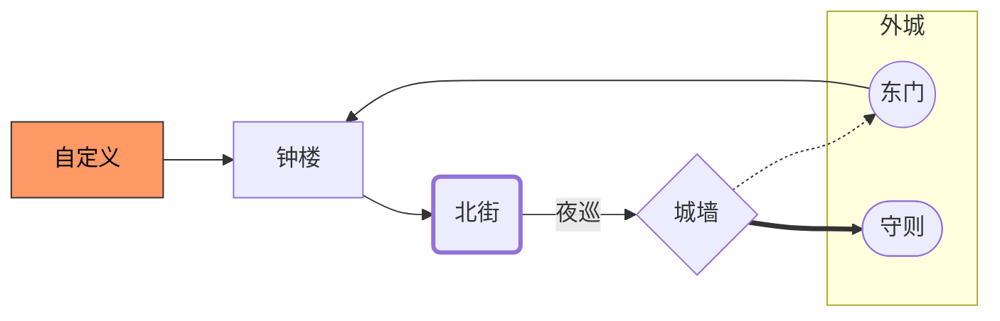
```mermaid
graph LR
  A[钟楼] --> B(北街)
  B -->|夜巡| C{城墙}
  C -.-> D((东门))
  C ==> E([守则])
  D --> A
  subgraph 外城
    D
    E
  end
  F[自定义]:::hot --> A
  classDef hot fill:#f96,stroke:#333,color:#000
  style B stroke-width:3px
```

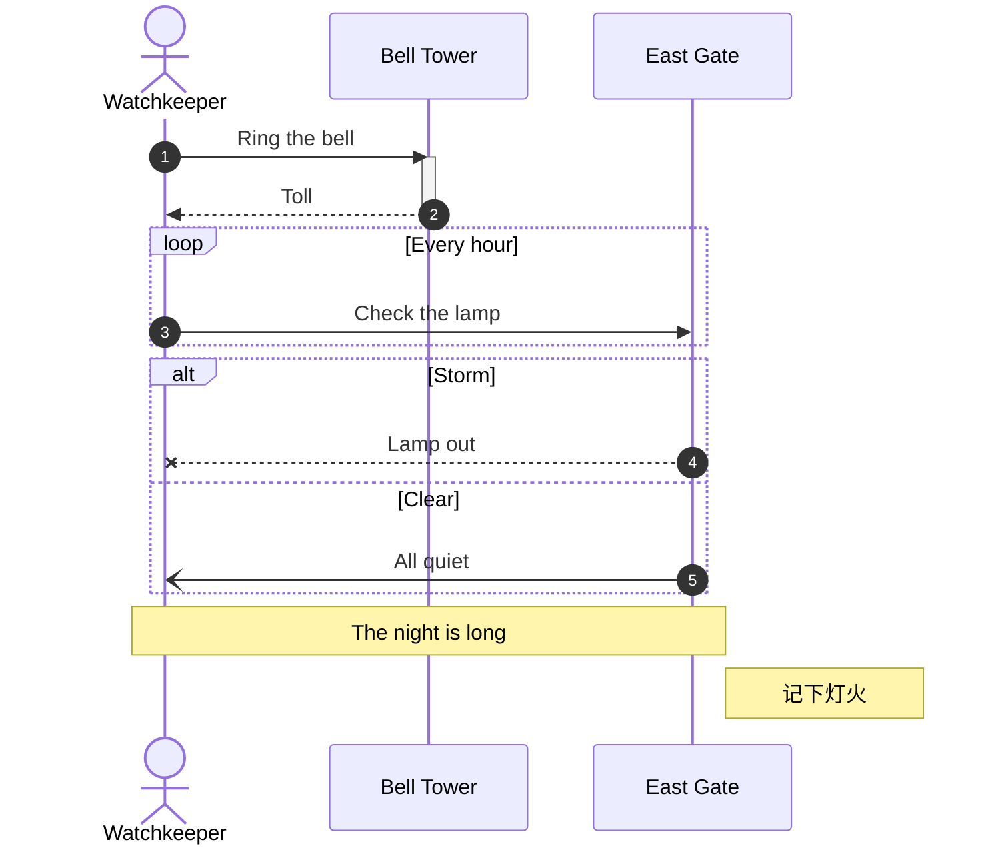
```mermaid
sequenceDiagram
  autonumber
  actor W as Watchkeeper
  participant T as Bell Tower
  participant G as East Gate
  W->>T: Ring the bell
  activate T
  T-->>W: Toll
  deactivate T
  loop Every hour
    W->>G: Check the lamp
  end
  alt Storm
    G--xW: Lamp out
  else Clear
    G-)W: All quiet
  end
  Note over W,G: The night is long
  Note right of G: 记下灯火
```

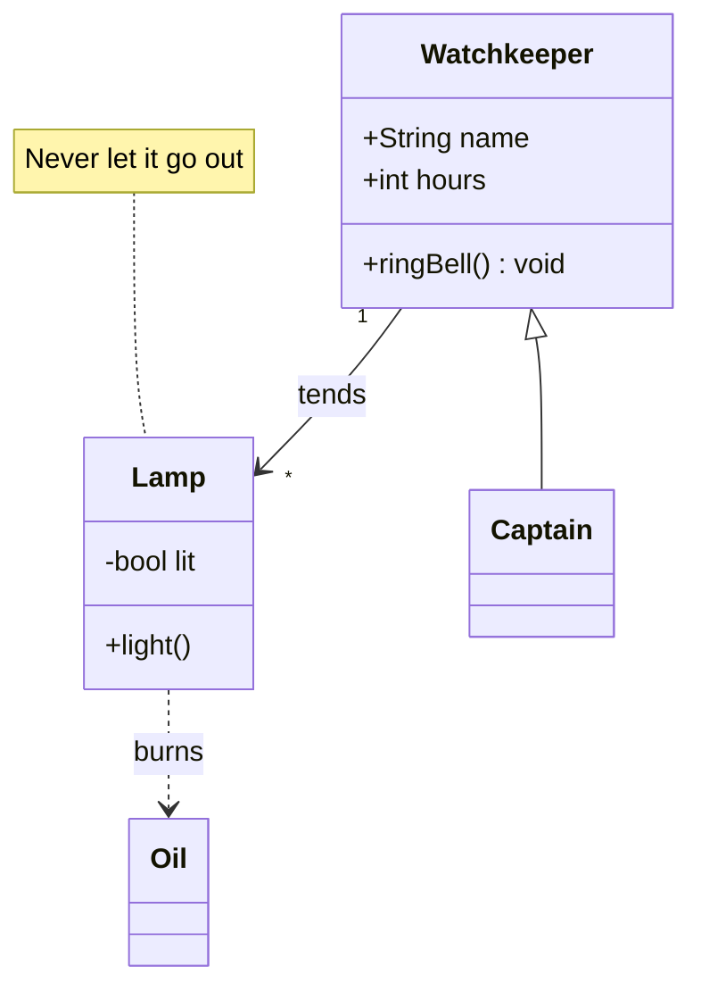
```mermaid
classDiagram
  class Watchkeeper {
    +String name
    +int hours
    +ringBell() void
  }
  class Lamp {
    -bool lit
    +light()
  }
  Watchkeeper "1" --> "*" Lamp : tends
  Watchkeeper <|-- Captain
  Lamp ..> Oil : burns
  note for Lamp "Never let it go out"
```

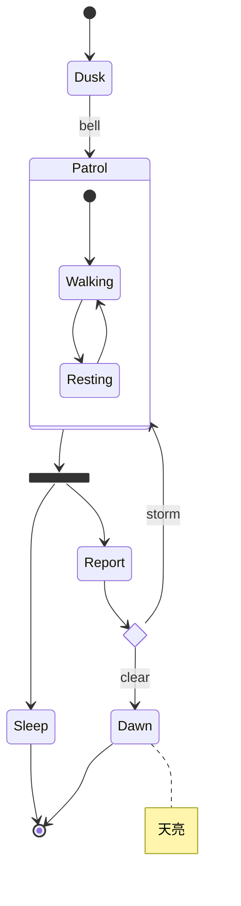
```mermaid
stateDiagram-v2
  [*] --> Dusk
  Dusk --> Patrol : bell
  state Patrol {
    [*] --> Walking
    Walking --> Resting
    Resting --> Walking
  }
  state fork1 <<fork>>
  Patrol --> fork1
  fork1 --> Report
  fork1 --> Sleep
  state check <<choice>>
  Report --> check
  check --> Dawn : clear
  check --> Patrol : storm
  Sleep --> [*]
  note right of Dawn : 天亮
  Dawn --> [*]
```

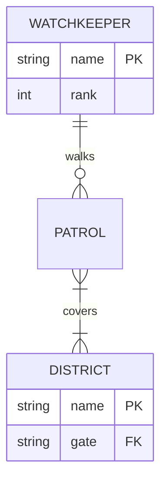
```mermaid
erDiagram
  WATCHKEEPER ||--o{ PATROL : walks
  PATROL }|--|{ DISTRICT : covers
  WATCHKEEPER {
    string name PK
    int rank
  }
  DISTRICT {
    string name PK
    string gate FK
  }
```

```mermaid
gantt
  title Night shift
  dateFormat HH:mm
  axisFormat %H:%M
  section Bell Tower
    Ring dusk bell :done, a1, 18:00, 30m
    Watch       :active, a2, after a1, 2h
  section Walls
    Patrol north :crit, b1, 19:00, 90m
    Patrol east  :b2, after b1, 1h
    Dawn :milestone, m1, 23:00, 0m
```

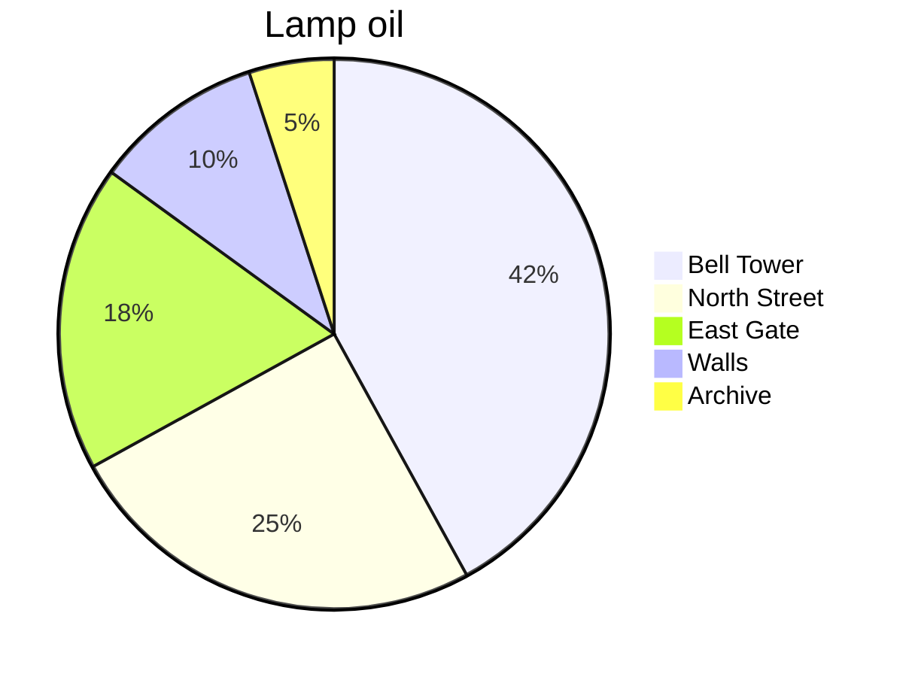
```mermaid
pie title Lamp oil
  "Bell Tower" : 42
  "North Street" : 25
  "East Gate" : 18
  "Walls" : 10
  "Archive" : 5
```

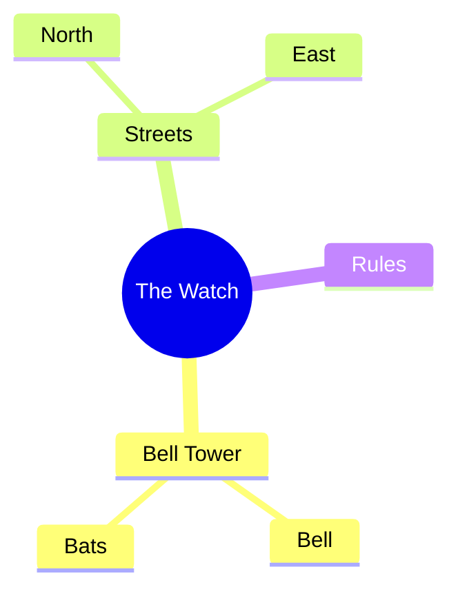
```mermaid
mindmap
  root((The Watch))
    Bell Tower
      Bell
      Bats
    Streets
      North
      East
    Rules
```

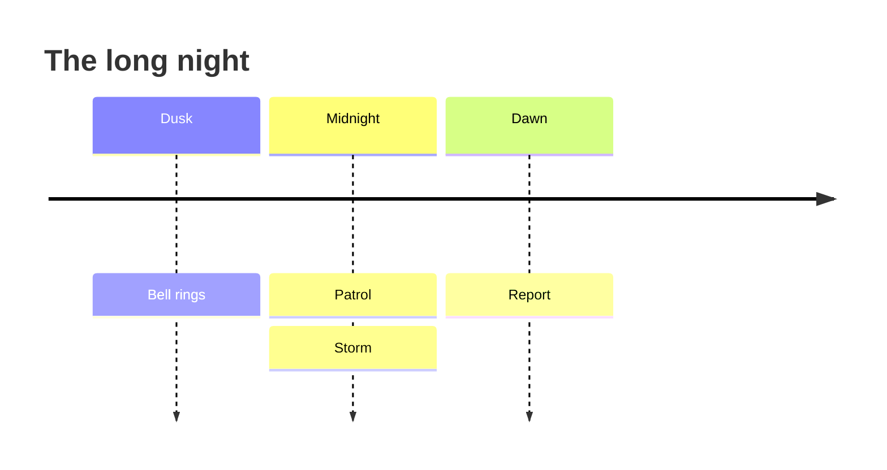
```mermaid
timeline
  title The long night
  Dusk : Bell rings
  Midnight : Patrol : Storm
  Dawn : Report
```

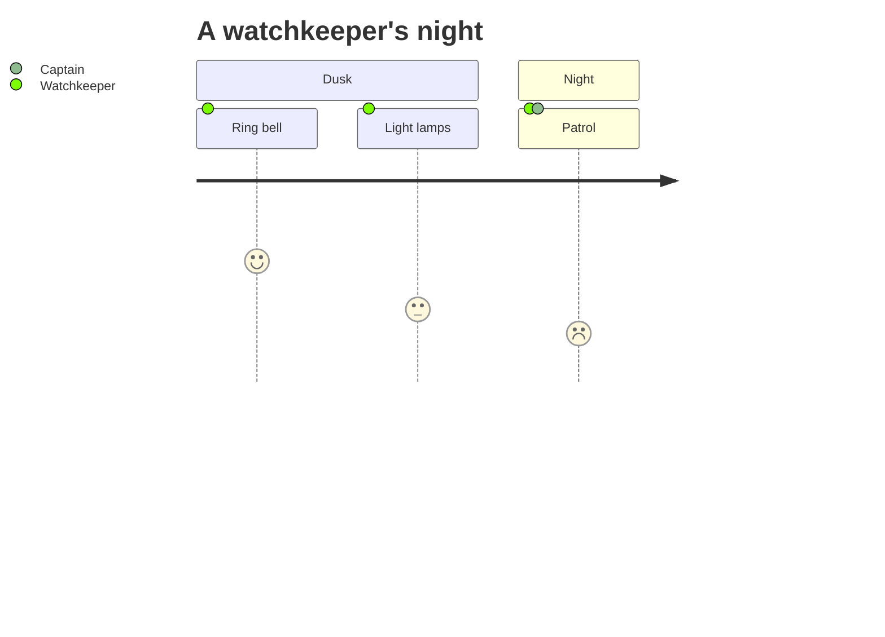
```mermaid
journey
  title A watchkeeper's night
  section Dusk
    Ring bell: 5: Watchkeeper
    Light lamps: 3: Watchkeeper
  section Night
    Patrol: 2: Watchkeeper, Captain
```

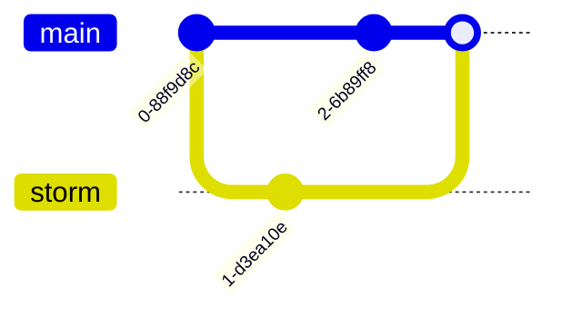
```mermaid
gitGraph
  commit
  branch storm
  commit
  checkout main
  commit
  merge storm
```

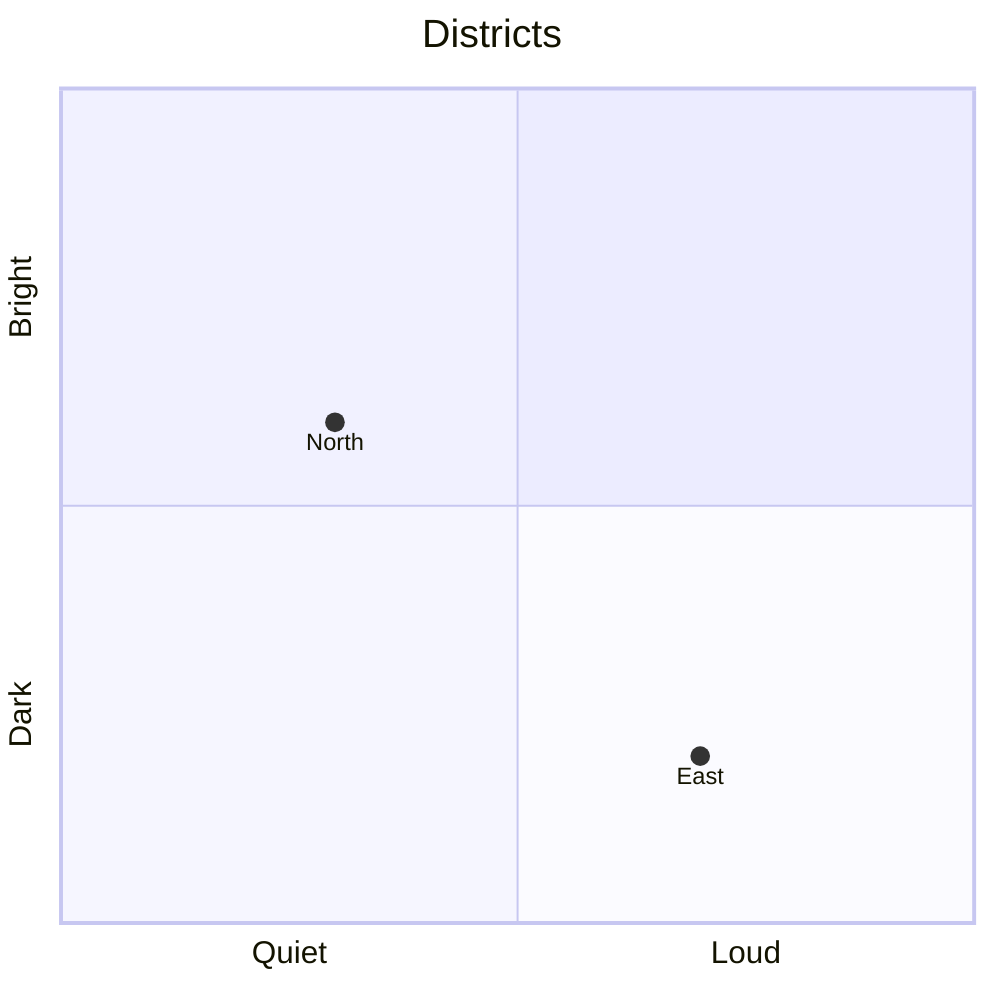
```mermaid
quadrantChart
  title Districts
  x-axis Quiet --> Loud
  y-axis Dark --> Bright
  North: [0.3, 0.6]
  East: [0.7, 0.2]
```

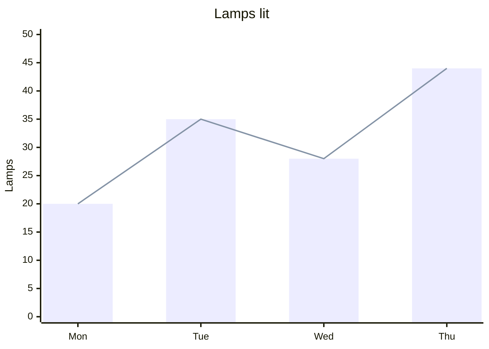
```mermaid
xychart-beta
  title "Lamps lit"
  x-axis [Mon, Tue, Wed, Thu]
  y-axis "Lamps" 0 --> 50
  bar [20, 35, 28, 44]
  line [20, 35, 28, 44]
```
